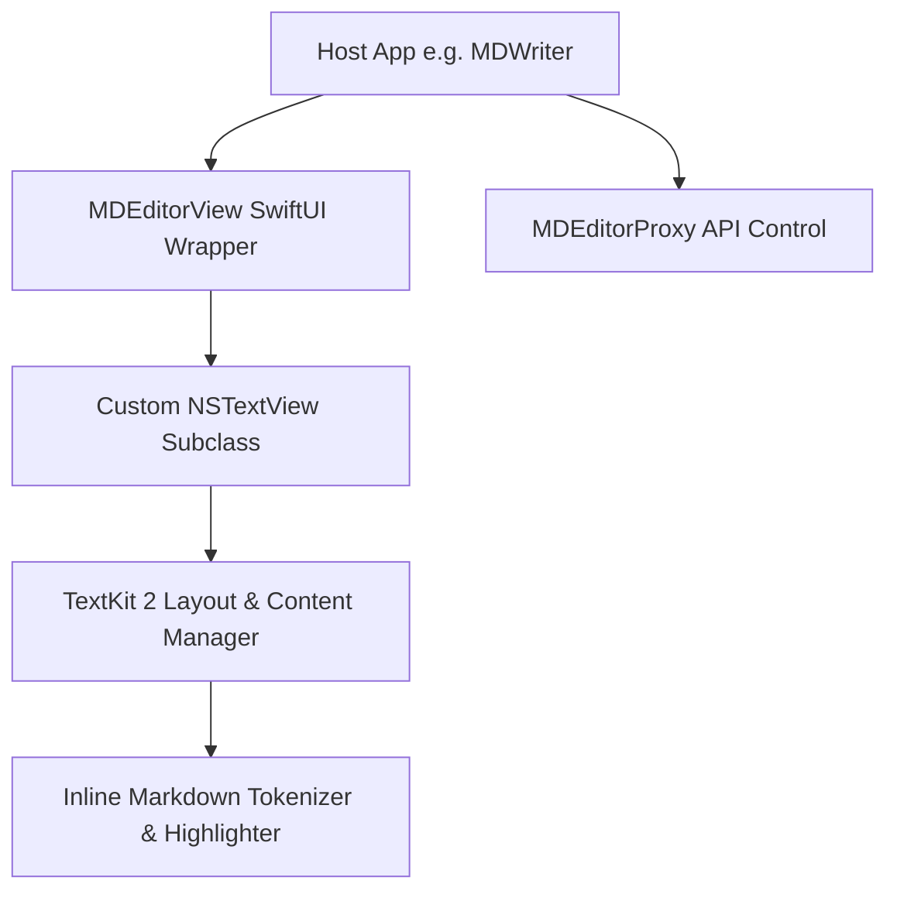

# System architecture

```mermaid
graph TD
    Host[Host App e.g. MDWriter] --> MDEditorView[MDEditorView SwiftUI Wrapper]
    MDEditorView --> NSTextView[Custom NSTextView Subclass]
    NSTextView --> TK2[TextKit 2 Layout & Content Manager]
    TK2 --> Parser[Inline Markdown Tokenizer & Highlighter]
    Host --> Proxy[MDEditorProxy API Control]
```
