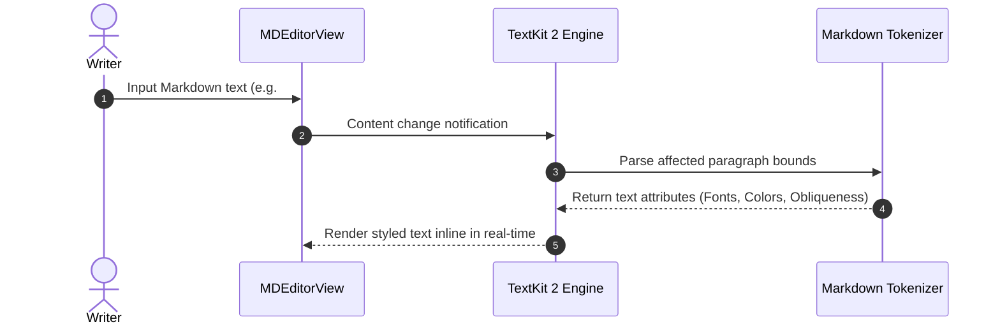

# Key flows

```mermaid
sequenceDiagram
    autonumber
    actor Writer
    participant View as MDEditorView
    participant TK2 as TextKit 2 Engine
    participant Parser as Markdown Tokenizer

    Writer->>View: Input Markdown text (e.g. ## Heading)
    View->>TK2: Content change notification
    TK2->>Parser: Parse affected paragraph bounds
    Parser-->>TK2: Return text attributes (Fonts, Colors, Obliqueness)
    TK2-->>View: Render styled text inline in real-time
```
